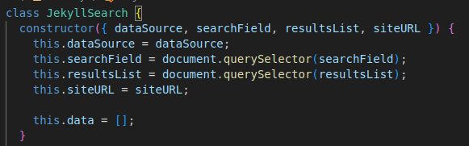

# Práctica: Jekyll search

Autor: Saúl Martín García

Asignatura: Sistemas y Tecnología Web: Servidor

Curso: 2024-2025

Universidad de La Laguna

## Busca en todos los ficheros, no solo los de los posts sino también los de las páginas

Para que busque en los ficheros de las páginas, el fichero `search.json` contiene el siguiente código que asigna a la variable de de busqueda no solo los ficheros de los posts sino también los de las páginas:

```json
    

    
      {
        "title": {{ page.title | jsonify }},
        "excerpt": {{ page.excerpt | markdownify | strip_html | jsonify }},
        "content": {{ page.content | markdownify | strip_html | jsonify }},
        "url": {{ site.baseurl | append: page.url | jsonify }}
      },
    
```

## Admite expresiones regulares


## Los resultados vayan apareciendo conforme tecleamos


## Se muestra una lista de enlaces a los ficheros que contienen la expresión buscada y un resumen de las primeros caracteres del fichero


## El constructor de JekyllSearch recibe en un objeto los argumentos en vez de posicionalmente



## Se ha hecho un resumen del capítulo 2 Lifecycle types and their rationales del libro _Developing Information Systems_, editado by James Cadle


## Kanban Board project conteniendo las incidencias de la rúbrica


