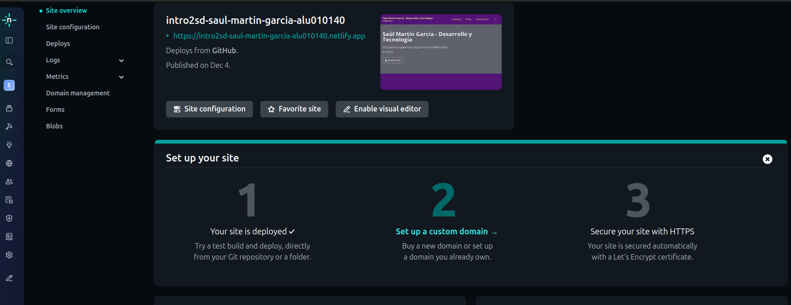
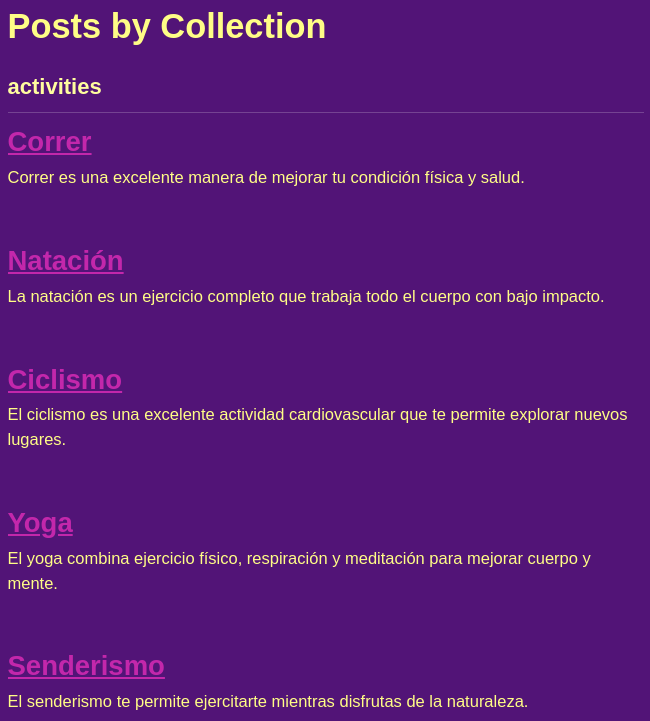
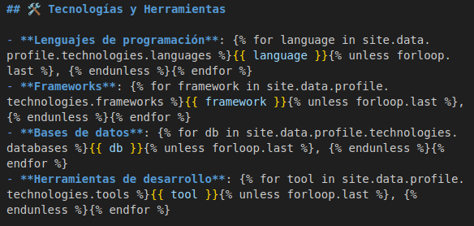
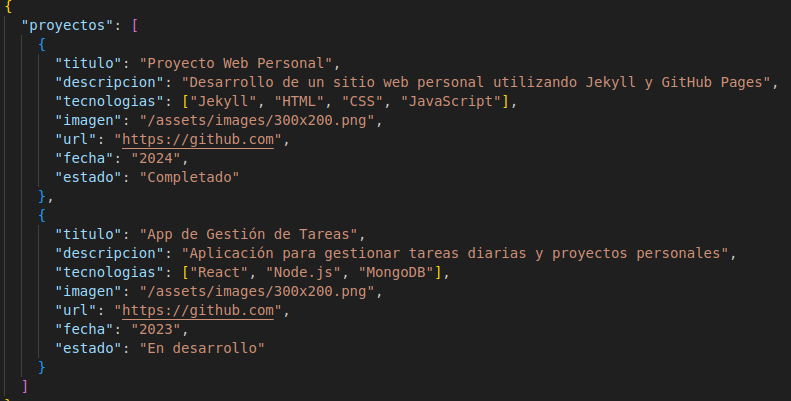
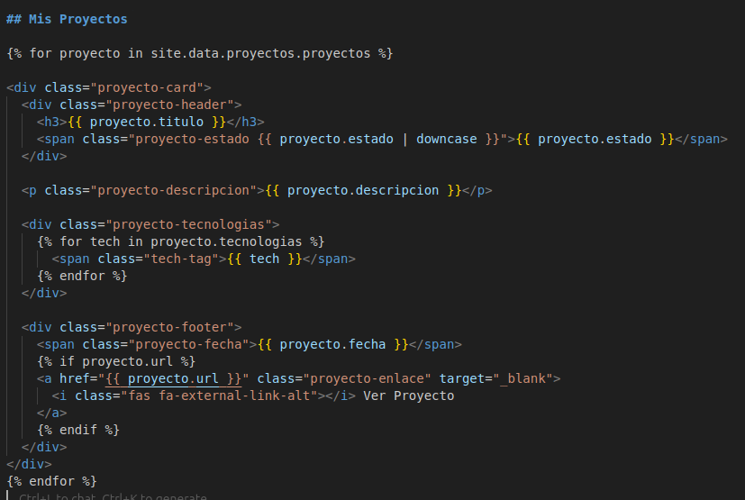
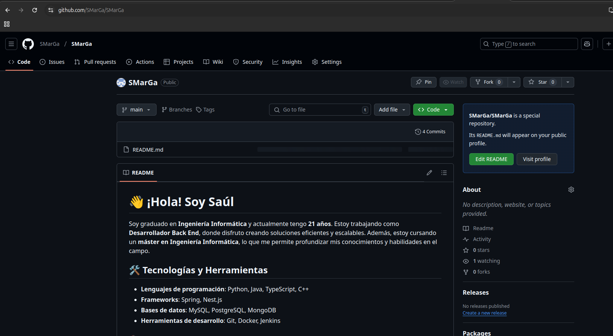

# Práctca "Introduction to Systems Development" and Static Generators

Autor: Saúl Martín García

Asignatura: Sistemas y Tecnología Web: Servidor

Curso: 2024-2025

Universidad de La Laguna

## Desplegar la página en GitHub Pages

La aplicación se ha desplegado en [GitHub Pages](https://ull-mii-sytws-2425.github.io/intro2sd-saul-martin-garcia-alu0101405810/).

El comando utilizadopara desplegar la página es:

```bash
bundle exec jekyll serve
```

## Resumen de libro

El resumen del Capítulo 1: Introduction to Systems Development del libro "Developing Information Systems : Practical Guidance for IT Professionals" se encuentra en esta [página](https://ull-mii-sytws-2425.github.io/intro2sd-saul-martin-garcia-alu0101405810/post%20formats/informe/).

## GitHub Board

Se usa el table de GitHub para gestionar las tareas del proyecto.


## Despliegue en Netlify

Se ha desplegado la web en [Netlify](https://intro2sd-saul-martin-garcia-alu010140.netlify.app/).



## Jekyll Collection

Se han creado dos colecciones:

- \_sports: contiene posts relacionados con deportes.


- \_activities: contiene posts relacionados con actividades.



## Uso de Liquid

Se ha usado Liquid en diferentes partes del la página de contacto.

Uno de los ejemplos es el siguiente:



Donde se usa liquid para mostrar las tecnologías que se manejan.

## Uso de fichero .json en \_data

Se ha creado un fichero .json en la carpeta \_data para almacenar los datos referentes a posibles proyectos realizados.



Estos datos despues se muestran en la página de about en una sección llamada "Mis Proyectos".


Tambien se usa Liquid para mostrar estos datos en la página de about.



## Desarrollo de pagina personal en GitHUb



## Pagina enlazada con el perfil de GitHub


